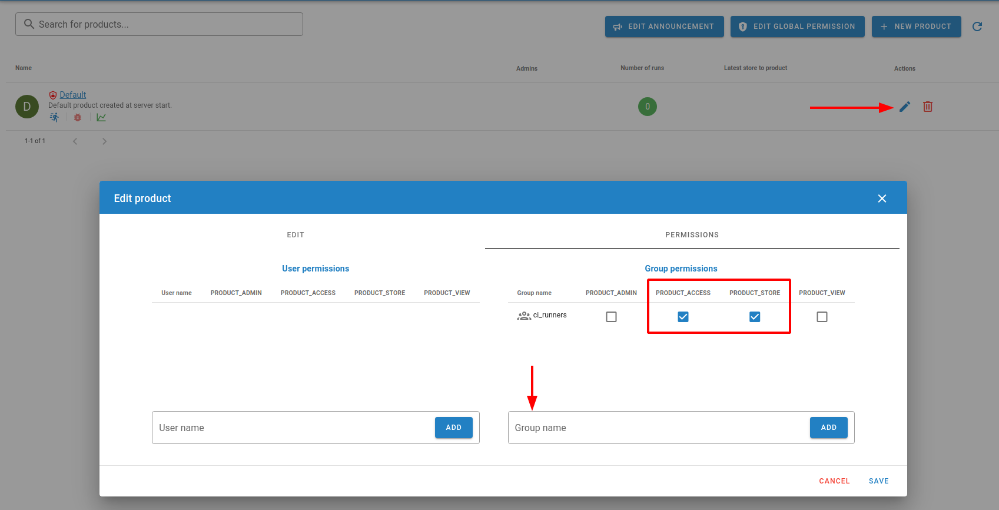

# Codechecker server

This repository contains required scripts and instructions for setting up,
running and maintaining CodeChecker server.

## Table of contents

<!-- vim-markdown-toc GFM -->

- [Codechecker server](#codechecker-server)
  - [Table of contents](#table-of-contents)
  - [Setup server](#setup-server)
  - [Setup authentication](#setup-authentication)
    - [Adding a new user as a server admin](#adding-a-new-user-as-a-server-admin)
    - [Setting up command line access as a user](#setting-up-command-line-access-as-a-user)
  - [Changing permissions](#changing-permissions)
  - [Providing credentials to the CI runners](#providing-credentials-to-the-ci-runners)
    - [Setting up authentication in GitHub Actions](#setting-up-authentication-in-github-actions)
  - [Suggested user and group setup](#suggested-user-and-group-setup)
  - [Creating new products - Codechecker integration in East](#creating-new-products---codechecker-integration-in-east)
  - [Relevant documentation](#relevant-documentation)

<!-- vim-markdown-toc -->

## Setup server

1. Install Docker Engine:

```
./scripts/install_docker.sh
```

2. Start CodeChecker server.

```
./scripts/start_server.sh
```

3. Run the commands below to see the logs generated by the `start_server.sh` script to get the randomly generated superuser name and
   password.

```
docker ps -a
```

Above command will print information about running containers:

```
CONTAINER ID   IMAGE                                COMMAND                  CREATED         STATUS         PORTS                                       NAMES
d3d3c749c5fb   codechecker/codechecker-web:latest   "/tini -- /usr/local…"   3 minutes ago   Up 3 minutes   0.0.0.0:8001->8001/tcp, :::8001->8001/tcp   irnas-codechecker-software-codechecker-1
```

Note the `CONTAINER ID` of the `codechecker/codechecker-web:latest` container and run

```
docker logs <CONTAINER_ID>
```

Note the superuser credentials somewhere safe.

4. Test if you can access the server via `8001`. If you are running this on a
   local development machine you can try opening `127.0.0.0:8001` url address in
   your browser. If you are running this on some AWS or Azure instance you will
   need to expose the IP and port.

## Setup authentication

After first server run a `workspace` folder with default configuration files is
created inside the project's root directory. This folder will later also contain
database files created by CodeChecker.

Authentication is handled in the `workspace/server_config.json` file.

1. Open it and set `authentication.enabled` to `true`. Do the same for the
   `authentication.method_dictionary.enabled`.

2. Restart server for changes to take effect:

```
./scripts/stop_server.sh
./scripts/start_server.sh
```

3. Try opening the same IP address as before. A login will be required. You can
   login as superuser with previously printed credentials.

### Adding a new user as a server admin

The `authentication.method_dictionary` contains a plaintext `username:password`
credentials for authentication. If the user's login matches any of the
credentials listed, the user will be authenticated.

Groups are configured in a map which maps to each username the list of groups
the user belongs to.

For example, below snippet adds two users, `admin` and `user` which have
passwords `admin_pass` and `user_pass` respectively. `admin` belongs to a groups
`admin` and `guest`, while `user` only belongs to the `guest` group.

```json
"method_dictionary": {
  "enabled" : true,
  "auths" : [
      "admin:admin_pass",
      "user:user_pass"
  ],
  "groups" : {
      "admin" : ["admin", "guest"],
      "user" : ["guest"]
  }
}
```

**Important**: When choosing passwords, use either 1Password generator, or some
other password generator.

### Setting up command line access as a user

Any CodeChecker commands that are accessing the server require login.

To perform that you need to run:

```
CodeChecker cmd login --url <server_url>
# or this if using east
east codechecker bypass cmd login --url <server_url>
```

## Changing permissions

User and group permissions are managed via Web UI. `EDIT GLOBAL PERMISSIONS` is
visible to the superuser and users with elevated permissions.

## Providing credentials to the CI runners

Codechecker provides a way to specify credentials via file. This is a desired
method for the GitHub Action Runners.

Steps:

1. Create a new `user:password` pair in `workspace/server_config.json` file.
2. Create two new secrets in the repository. Name them `CODECHECKER_SERVER_URL`
   and `CODECHECKER_CREDENTIALS`.
3. Set `CODECHECKER_SERVER_URL` to contain full url of the Codechecker server.
```
<url_to_server>
```
4. Set `CODECHECKER_CREDENTIALS` to contain whitespace-removed JSON string
   contains credential data.

```
{"client_autologin":true,"credentials":{"<url_to_server>":"<username>:<password>"}}
```

### Setting up authentication in GitHub Actions

See below snippet on how to access the secrets in GitHub Actions.

```yaml
steps:
  - name: Prepare CodeChecker password file
    env:
      CODECHECKER_CREDENTIALS: ${{ secrets.CODECHECKER_CREDENTIALS }}
    run: |
      echo $CODECHECKER_CREDENTIALS > ~/.codechecker.passwords.json

  - name: Login to CodeChecker server
    env:
      CODECHECKER_SERVER_URL: ${{ secrets.CODECHECKER_SERVER_URL }}
    run: |
      east codechecker bypass cmd login --url "$CODECHECKER_SERVER_URL"
```

## Suggested user and group setup

Below setup is sufficient, if all users are allowed to access all projects
stored on the CodeChecker server. Permissions can then be managed per group
basis.

```json
"method_dictionary": {
  "enabled" : true,
  "auths" : [
      "admin:admin_pass",
      "user_1:user1_pass"
      "user_2:user2_pass"
      "ci_runner:ci_runner_pass"
  ],
  "groups" : {
      "admin" : ["admin"],
      "user_1" : ["users"]
      "user_2" : ["users"]
      "ci_runner" : ["ci_runners"]
  }
}
```

- Admin is the only one with elevated permissions, he can create new products.
- Users can view projects.
- CI runners have store and access permissions.

## Creating new products - Codechecker integration in East

To create a new product navigate to your CodeChecker server and login as `admin`. 

1. Click on the `New Product` button and fill in the required fields.

Make sure that the URL endpoint of the
product matches the exact name of the git repository. This is needed as the
`east codechecker store` command finds out the name of the git repository and
uploads any analyses to the `<server_url>/<git_respository>` endpoint.

For example, if you are creating a new product for the repository hosted on
`https://github.com/CoolOrg/some-cool-project-repo`, then URL endpoint _must_ be
`some-cool-project-repo`.

2. Select the `SQLite` database type and name your database. Click `Save`.
3. Click on the `Edit` button for the newly created product.
4. Add the `ci_runners` group and assign the `PRODUCT_ACCESS` and `PRODUCT_STORE` permissions to it. This will allow the CI runners to store and access analyses for this product.



5. To give users permissions to access the product, repeat step 4. but add the `users` group instead of `ci_runners`. When assigning permissions assign the `PRODUCT_ACCESS` and `PRODUCT_VIEW` permissions to the `users` group.

## Relevant documentation

- [Docker Engine Installation](https://docs.docker.com/engine/install/ubuntu/#install-using-the-repository)
- [CodeChecker Server Authentication](https://codechecker.readthedocs.io/en/latest/web/authentication/)
- [CodeChecker Docker Compose setup](https://hub.docker.com/r/codechecker/codechecker-web)
